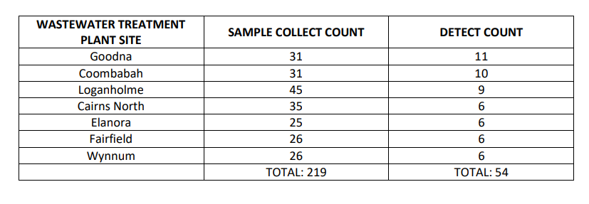
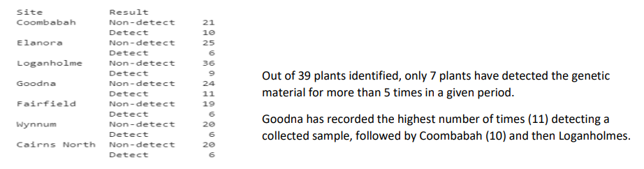
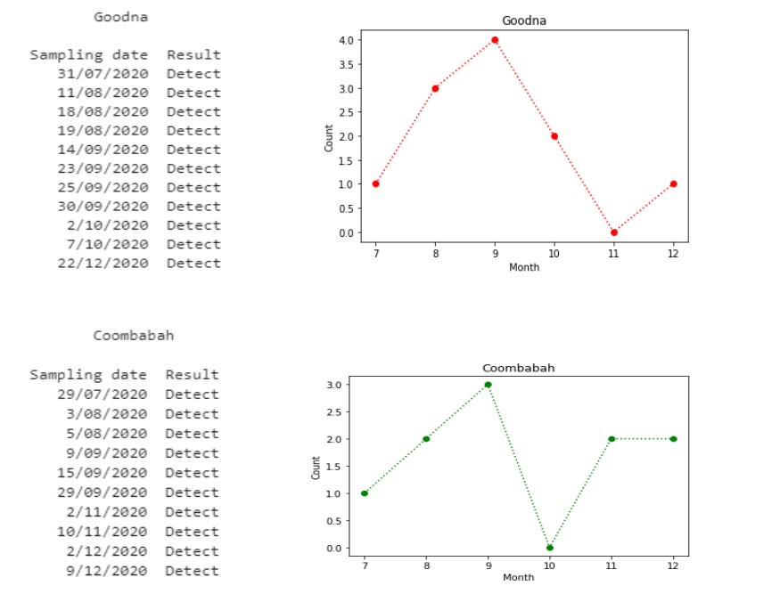
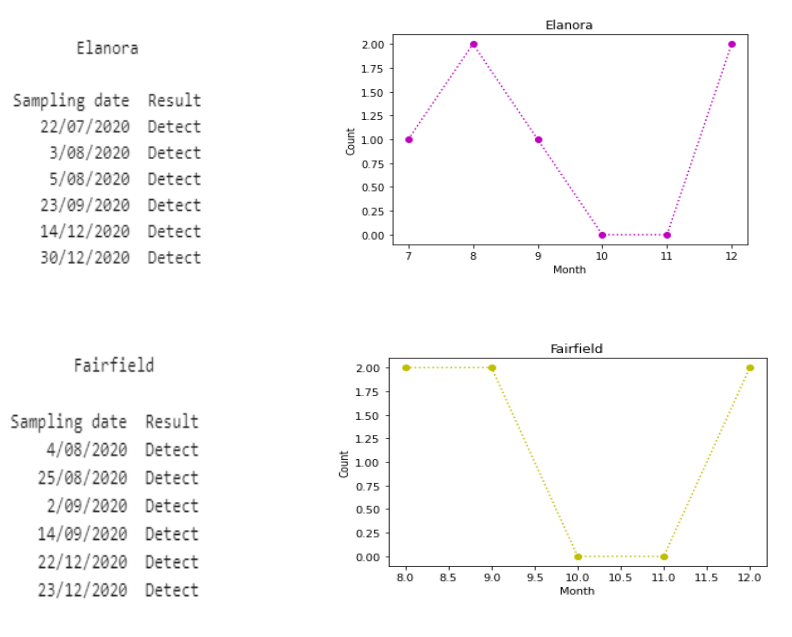
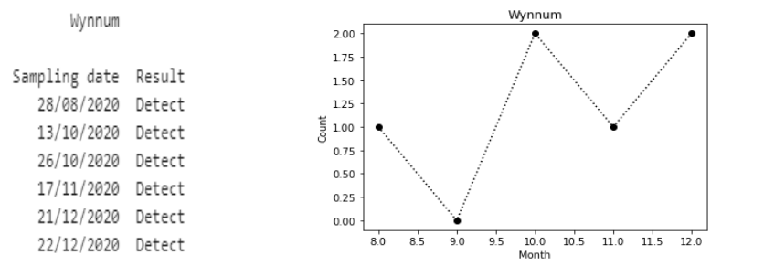
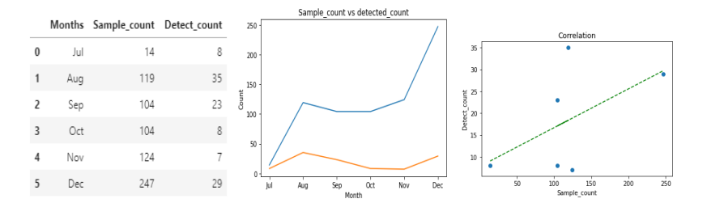

# SUBURBS SERVICED BY WASTE-WATER TREATMENT PLANT DETECTING GENETIC MATERIAL (SARS-CoV-2) ARE HIGHLY PRONE TO COVID-19 INFECTION SPREAD

### ELABORATION ON THE PROBLEM:
##### Key Question --> *Which suburb/region serviced by wastewater site are potentially at a higher risk of infection?* 
Tracking regions in Queensland state that are exposed to the virus (COVID-19) based on the genetic material (SARS-Cov-2) that are frequently detected in waste-water treatment plant servicing them. With the help of Queensland Health waste-water surveillance data, the vulnerable sites identified can then be reported to the respective stakeholders so that timely measures/actions can be taken to control or restrict the disease spread.

### ABSTRACT:
Following the evidence of the genetic material SARS-CoV-2 getting detected in the Sewage sludge, it is pertinent to 
develop a relation between the samples detected in a particular treatment plant and the transmission/spread of 
infection in the associated suburbs. A brief description about the wastewater surveillance approach has been 
explained under “Introduction” section of the report. The data analysis performed for the key problem is data 
driven; however, critical analysis is simultaneously done to avoid any confoundedness, erroneousness or biasness in 
the data. The descriptive analysis of the Queensland govt. wastewater surveillance data basically filters out all sites
except those that have recorded the detection count for more than 5 numbers of times, over a period of 6 month 
data. There are 3 analyses done under the descriptive analysis section and the corresponding results along with the 
graphical outcomes have been explained in the “Result” section. Since my primary question was to see whether a
COVID-19 spread in a particular region/suburb is severe, I went further explaining the predictive analysis approach 
with the help of graphs and conditional probability. The predictive analysis is done using Bayesian network technique 
to predict the uncertainty in the variable that estimates high or low risk region based on conditional probability. The 
report provides a key problem and with the help of analysis, draws vital conclusion to curb the potential breakout of 
infection. It becomes very important to share my work with the concerned authorities,
* Public Health Authority (Queensland govt.)
* People associated with wastewater research work
* People working for media house in Queensland

The problem discovered needs to be addressed to them along with the appropriate analysis so that timely measures are taken to mitigate the spread of the disease. Also, to check the list of suburbs serviced by the wastewater plants, the link is shared below.   
[Queensland Wastewater surveillance data](https://www.qld.gov.au/health/conditions/health-alerts/coronavirus-covid-19/current-status/wastewater)

### INTRODUCTION:
To understand the full extent of the COVID-19 pandemic is still considered as an ongoing challenge for many health 
officials across the globe. Monitoring sewage for traces of pathogen enables effective surveillance of entire 
communities, based on the experience with other viral diseases. It helps in providing a sensitive signal to detect the 
pathogen present in the population, and if the transmission is increasing. Many researchers around the world are 
using wastewater data, over the data collected from epidemiological indicator or diagnostic test results, for
calculating the prevalence. Study says the novel corona virus (SARS-CoV-2) has already been detected in wastewater, 
and wastewater monitoring could be a powerful tool in generating high-resolution dataset from sewage sludge and 
tracking the spread of COVID-19.
Advantages of wastewater monitoring approach include:
* The approach effectively records the increase or decline of COVID-19 cases in a medium sized region.
* Collects high-resolution data from people who lack access to healthcare.
* A cost-effective approach to survey the change in rate of transmission in entire communities.
* This approach can reveal infection dynamics earlier than diagnostic testing, producing approximately a real 
time information on disease prevalence.

### DATA AVAILABILITY AND DESCRIPTION:
Data used in my analysis is available in the official website page of Queensland government under the open data 
portal section. The data provided in that site has the record of sample collection done over a period of 6-months (in 
the latter half of the year) in 2020. The link for the same is shared below,  
[Queensland wastewater surveillance data for SARS-CoV-2 in 2020](https://www.data.qld.gov.au/dataset/queensland-wastewater-surveillance-for-sars-cov-2/resource/0e7a7d67-435c-4d24-9e6f-23c28a6a8cff)  
The wastewater surveillance data has got 727 entries of sampling date and all the corresponding entries for Site, 
Result, Site population and Notes columns.  
  

### DESCRIPTIVE ANALYSIS OF THE WASTEWATER SURVEILLENCE DATA:  
After importing the wastewater data from Queensland government server, the first step that I did was cleaning and 
preparing the original dataset in order to remove any erroneous entries or any missing data. After completing the
pre-processing (only data cleaning part), I got a very good quality of data to begin with my analysis.
Since my key question is “Which suburbs in Queensland state are potentially at a higher risk of having COVID-19 
transmission spread?”, the first thing that I did was to see how many wastewater treatment plant sites are there 
within the state. It comes out to be 39. 
Also, I was interested in knowing how many samples were collected in total from every plant site along with the total 
samples detecting the genetic material. So, altogether 712 number of samples were collected from all the plant sites
and out of it 110 detected the pathogen for a duration of 6 months in 2020 (latter half). Outcomes for this analysis 
have been explained in result section of this report as ‘Analysis 1 outcome’ which includes month-wise record.
The next thing I did was to find all those wastewater treatment plant that has been frequently detecting the COVID-19 pathogen from the samples collected. Samples collected are basically the sewage sludge which is further 
investigated for the presence of the genetic material of COVID-19. I had assumed prior investigating this,  
##### *My Assumptions*
- The wastewater plant site that has reported SARS-CoV-2 genetic material detection for more than 5 times for the 
samples collected from the period July till December in 2020 indicates associated suburbs (that are being serviced by 
those wastewater treatment plants) are potentially at a higher risk of infection spread and this should be reported to 
the concerned stakeholders.
- It was found that there were 7 plants that had detected the COVID-19 pathogen in the collected samples for more 
than 5 times in a 6-month period.

  

##### *Conclusion drawn from my 1st analysis:*  
* The total detects count from all the above plant sites is 54 which constitute approximately 50% of the total 
number of samples detected in all the sites. 
* This gives a strong evidence for my assumption of selecting sites that has been reporting the detection for 
more than 5 times in the collected samples in a specified duration.
I went further with the exploration on those 7 plant sites to see on which date did the collected samples from each 
plant site detected the presence of pathogen in a given period of time. The detailed results/outcomes for this 
exploratory analysis have been explained intensively, in the result section of the report, under ‘Analysis 2 outcomes’. 
I would like to draw some conclusions.

##### *Conclusion drawn from my 2nd analysis:*  
* All the 7 plant sites detected the genetic material in the month of July (starting month of collecting the 
samples) making all the suburbs linked with the site as an area of concern.
* More interestingly in the month of December 2020 it was found that many among the 7 sites reported 
comparatively higher number of detections of the pathogen of the virus. 
* The plant site located in Crains North showed an alarming trend. It didn’t detect the virus genetic material 
from the samples collected from July till October; however, there was sharp rise seen in the count of 
detection from the samples collected in the month of November and December.

While I was examining my analyzed data exclusively for the plant sites showing higher count for the detection of the 
COVID-19 pathogens, I did notice a pattern between the samples being collected and samples that detected the 
genetic material. So, I further explored the potential relationship between the 2 for all the 39 wastewater treatment 
plants. The results of this analysis have been explained in the result section of this report, under ‘Analysis 3 
outcomes’.  

##### *Conclusion drawn from 3rd analysis:* 
The analysis showed a moderately high positive relationship between the samples that were detected and the 
number of samples that were collected. This indicated higher the number of samples collected better is the analysis 
for the problem.  

### RESULTS OF MY DESCRIPTIVE ANALYSIS:   

##### *Analysis 1 outcomes: -*    
  

##### *Analysis 2 outcomes: -*   
Results observed for the 2nd analysis shows the trend of detection count in each month for top 7 sites along with the 
date.  
  
   
   
   

##### *Analysis 3 outcomes: -*
   

Results observed from 3rd analysis showed a positive relation between the number of samples collected and 
detected samples. The correlation between the 2 comes out to be above 50% which means there is a moderately 
high correlation between the 2 variables. Also one can see, the highest number of sample collection (247) was done 
in the month of December and 29 samples detected the genetic material. 

